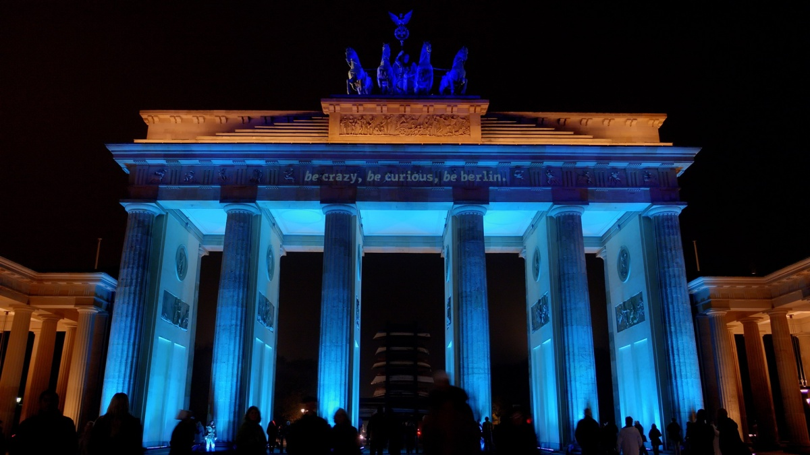

---
hide:
  - toc
---

# Social Events

## Special Collaboration Events:

### Early Career Scientists Meeting

Monday Oct 2nd from 1:30-2:30pm
Location: Humboldt University of Berlin, room: 1.101
No catering provided
 
### Public talk by Francis Halzen, UW-Madison

["Building a New Window on the Universe from Antarctica"](https://meetings.wipac.wisc.edu/sites/meetings/files/images/Abendvortrag_A3.pdf)
Date: Tuesday October 3rd at 7pm.
Location: Deutsche Physikalische Gesellschaft e.V.
Magnus-Haus, Am Kupfergraben 7, 10117 Berlin
 
### IceCube Women's Event: Gender Equality Efforts in Europe, by Lia Lang, DESY GENERA project manager and Tessa Carver, Université ge Genéve GENERA project member

This event will highlight the GENERA project, an ongoing European gender equality effort in the physics research field. Discussion will include project history, goals, achievements, and opportunities to contribute to this effort for individual members and the broader collaboration.
The IceCube Diversity Task Force is excited to offer another installment of the IceCube Womens' event.
Open to ALL members of the Collaboration
Date: Tuesday October 3rd from 6:30-8:00pm
Location: Humboldt University of Berlin, room: 1.205
Light catering provided
 
### Communications Workshop #6: Body Language-How to be Confident and Persuasive by Melanie Conrad PhD, GOLIN Science Management

This two-hour workshop will be coordinated by Dr. Melanie Conrad from GOLIN Science Management, a company specializing in skill development in the sciences. Topics will include: how body language influences physiology, dealing with stage fright and voice modulation for presention delivery. This is a continuation of the collaboration-wide training program for young IceCube researchers to improve their communication skills and expertise to better share their science with all audiences.
Date: Wednesday Oct 4th from 12:30- 2:30pm
Location: Humboldt University of Berlin, room: 1.205
Lunch provided
 
### Professional Development: Career Opportunities in Germany by Daniel Wagner, Director of Programs, German Scholars Organization and Dr. Uli Rockenbauch, Executive Assistant to the Managing Director, Helmhotz Association
This career development event will offer insight and perspective about professional opportunities available in Germany, both academia and industry. Some of these programs and grants are funded by the European Commision/European Research Council and may be relevant for people considering a career in other countries in Europe.
Date: Wednesday Oct 4th from 6:00-7:00pm, following the event there will be an informal social hour at a location nearby.
Location: Humboldt University of Berlin, room: 1.201

## We Organized the Following for You:

### Tempelhof airport- guided tour.

Go on a time journey
The former airport building is the largest monument of Europe. Our expert guides show the most varied sides of this unique building.
Location: Meet in the GAT area, use entrance Tempelhofer Dammn 9, 12101 Berlin, between U-Bahnhof Platz der Luftbrucke and U-Bahnhof Paradestr.
Price: 13,00 €/person
Starts: All tours will start at 4:30pm on Friday, October 6th
Tickets will be availalbe at the registraion desk until Tuesday Oct 3rd at lunch time
Webpage: [http://www.thf-berlin.de/en](http://www.thf-berlin.de/en)

## Sightseeing in Berlin and What's on?

### Sightseeing

Don't miss these famous places.
Webpage: [Sights](https://www.visitberlin.de/en/top-sights)
 
### Event Calendar

Webpage: [Events](https://www.visitberlin.de/en/event-calendar-berlin)
 
### Restaurants around Berlin

Restaurant map with key: [Restaurants](https://drive.google.com/open?id=1Ncbh_X82inOcziGCRvwx4N6dw5w&usp=sharing)
 
### Beer gardens

Also, for a nice cold beer check out the Biergarten!
Webpage: [Biergarten](https://www.tip-berlin.de/berliner-biergarten/)
 

### For biking we recommend "Berlin Wall bike tour" or other tours through BERLIN

Price: none
Starts: every time by yourself
Length: 5.7 kilometres/ 3.5 miles
Webpage: ["Berlin Wall"](https://www.visitberlin.de/en/berlin-wall-bike-tour)
Webpage for other tours: [bike tours](https://www.visitberlin.de/en/bike-tour-suggestions)

### Festival of Lights

Each year in October, Berlin turns into a city full of light art. The artful displays of the landmarks, monuments, buildings and places make the FESTIVAL OF LIGHTS one of the best known light art festivals in the world. Natinoal as well as international artists present light installations and thus, transform the city into a huge stage. They tell stories, draw attention to the special and present their cultures, arts, crafts and messages. Berlin landmarks, historical places, streets, squares, trendy neighborhoods and hotspots of recent history are staged with light.
Price: none
Starts: Friday, October 6th
Webpage: [FESTIVAL OF LIGHTS](http://festival-of-lights.de/en/)

### Berlin leuchtet

This is another illumination festival in Berlin with some lesser known buildings yet still significant.
Price: none
Happens: September 22nd through October 15th
Webpage: [Berlin leuchtet](https://meetings.wipac.wisc.edu/Berlin2017/socialevents#:~:text=Webpage%3A-,Berlin%20leuchtet,-%C2%A92023%C2%A0Board)
