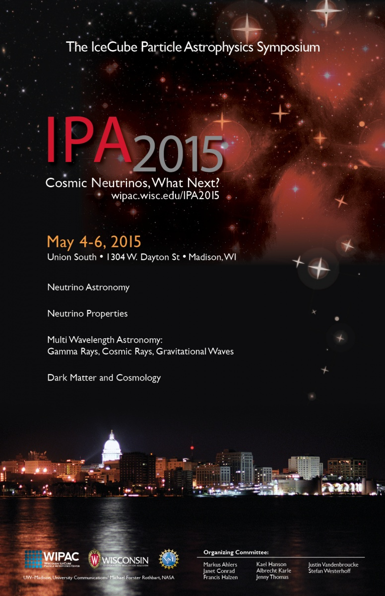

---
hide:
  - toc
---

# Home

We are pleased to announce that the IceCube Particle Astrophysics Symposium: Cosmic Neutrinos, What Next?, organized by the Wisconsin IceCube Particle Astrophysics Center ([WIPAC](http://wipac.wisc.edu/)), will take place in Madison, Wisconsin, from Monday, May 4 through Wednesday, May 6, 2015.
 
Following the success of the previous symposium, IPA2013, this second event in the IPA series continues the spirit of the historic Telemark meetings on neutrino physics. The topics include: 
- neutrino astronomy and related multiwavelength messengers—cosmic rays, high-energy gamma rays, gravitational waves;
- neutrino properties (including accelerator-based experiments); and
- related cosmological and dark matter aspects of particle astrophysics. 

The format will follow that of the Madison Pheno meetings with morning plenary talks and afternoon parallel sessions.  The meeting’s topics focus on the interplay between theory and experiment in resolving the major open questions in the field of particle astrophysics for the next decade.
 
The symposium will be held at University of Wisconsin–Madison’s [Union South](http://www.union.wisc.edu/visit-unionsouth.htm), situated on the central campus.
Confirmed plenary session talks: 
- Markus Ackermann, Diffuse gamma rays and neutrinos
- Segev BenZvi, Results from HAWC
- Douglas Bergman, Results from Telescope Array
- Olga Botner, IceCube Neutrino Observatory present and future
- Ronald Bruijn, Neutrino astronomy in the Mediterranean: past, present and future
- Scott Dodelson, Cosmology overview
- Dafne Guetta, High-energy neutrinos from gamma-ray bursts
- Alice Harding, Results from Fermi
- Karsten Heeger, Overview of reactor neutrino experiments
- Alex Himel, Results from T2K and status of the Fermilab Long-Baseline Neutrino Facility
- Hagar Landsmann, Results from the Xenon Dark Matter Project 
- Thomas O’Donnell, Status of CUORE and KamLAND-Zen experiments
- Ryan Patterson, Status of the NovA experiment
- Anne Schukraft, Status of MicroBooNE
- Christian Stegmann, Future of high-energy gamma-ray astronomy with air Cherekov telescopes
- Michael Unger, Ultra-high energy cosmic rays 
- Abigail Vieregg, Radio Detection of Ultrahigh-Energy Neutrinos
- Eli Waxman, IceCube's neturinos: What have we learned?
- Chao Zhang, Overview of JUNO
- Joseph Zennamo, Status of liquid argon neutrino experiments 

