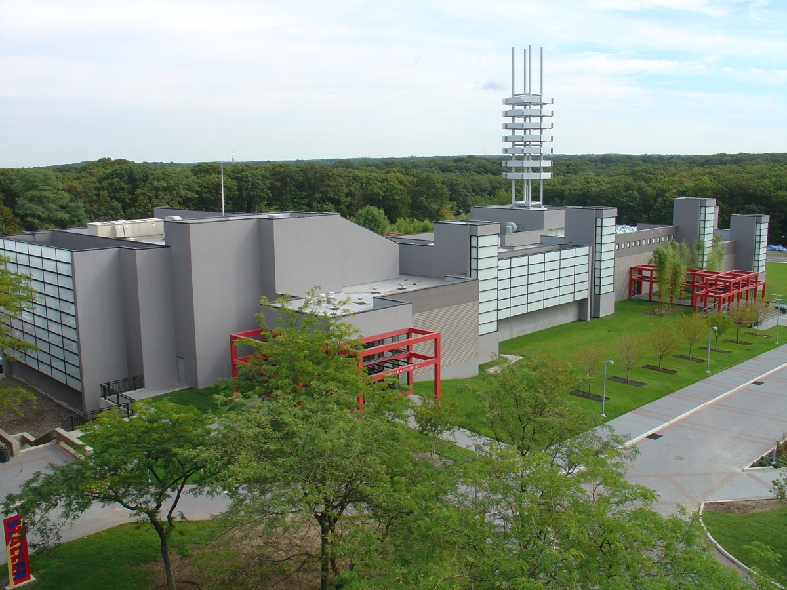
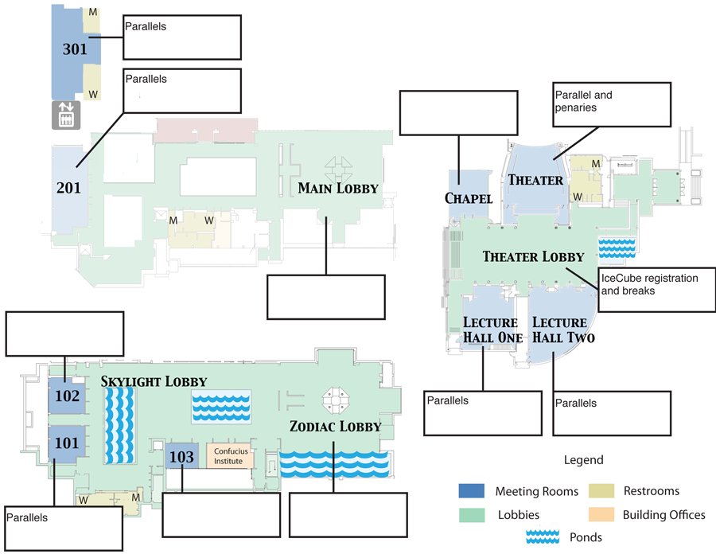
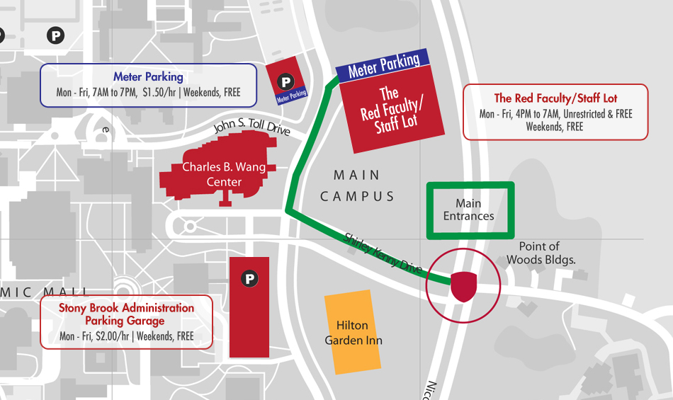
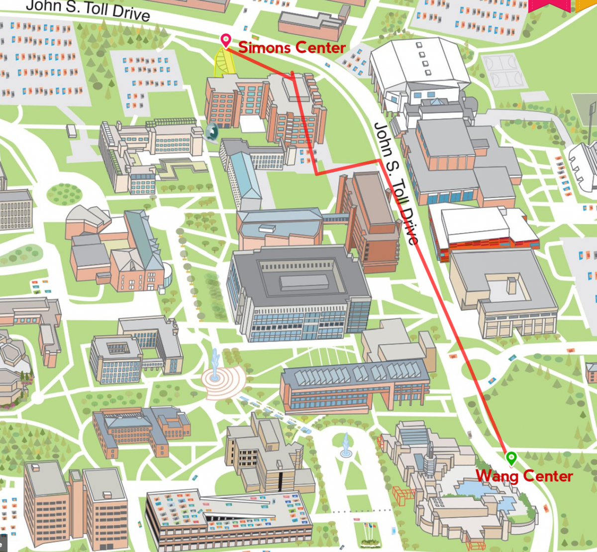

---
hide:
  - toc
---

# Location

## Venue Information: Columbia

Saturday and Sunday meetings will be at Pupin Hall.  Please note you must use the Campus Entranceof Pupin Hall, from the Plaza above the Dodge Physical Center,which will be on the 5th floor of the building. You can then enter either of our rooms from the top of the lecture halls, on the 4th floor.

Meetings on Monday are in the Faculty House.

## Venue Information: Stony Brook

The main meeting will be held at Stony Brook University at the Wang Center, 100 Nicolls Road. Registration will be in the the theater lobby on the main floor. All plenary sessions will be in the theater, also on the main floor. Parallel session rooms change daily, please see the program for more details. Wireless is available through eduroam or with guest access accounts. Access accounts will be provided with registration materials on the first day of the meeting.  

### Collaboration Meeting Spaces  

Parking at the Wang Center

Parking for the Wang Center is available in the Stony Brook Administration parking garage for a fee. A reduced rate of $5 per day is available when you pre-pay on the meeting payment page.  If you pre-pay, we will have your parking vouchers at registration on the first day of the meeting, you won't need the voucher until you leave the parking garage. A full campus map is available here. 

## Travel Information

Most people will arrive at one of the New York airports and take transit or a cab to their hotel in New York City for pre-meetings, or take a shuttle or a cab to their hotel at Stony Brook.  We are arranging a shuttle from Columbia University to Stony Brook University on Monday afternoon.  To sign up, please purchase a ticket when you pay your meeting registration fee. 

## Area Information and Events

### Welcome Party

The welcome party will be at the Simons Center from 6-7:30pm on Tuesday, April 19.  The Simon Center is a short walk from the Wang Center.

### Banquet

The collaboration banquet will be at 6pm on Thursday, April 21 at the Hilton Garden Inn.  The cost of the banquet is included in the registration fee.  Additional banquet tickets may be purchased for guests for $65 each, please pay when you pay for your conference registration fee. 

### More information

- [Area restaurants](http://nngroup.physics.sunysb.edu/husep/Henderson_DUSEL_Capstone/restaurant.html)
- [Student-recommended restaurant and bars](https://docushare.icecube.wisc.edu/dsweb/Get/Document-76660/Bars.pdf)
- [What to do on Long Island](http://www.discoverlongisland.com/!userfiles/Suffolk/SuffolkCountyTravelGuide.pdf)

