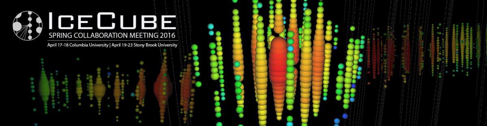

---
hide:
  - toc
---

# Schedule

## Schedule Overview:

Please see the Indico timetable for the detailed schedule

**Saturday, April 16**

PINGU, Software pre-meetings 2-6pm (Columbia University) outreach event (Nevis Labs)

**Sunday, April 17**

PINGU, Software pre-meetings, HEA (Columbia University)

**Monday, April 18**

Gen2, Software pre-meetings (Columbia University)

**Tuesday, April 19**

Parallel sessions (Stony Brook, Wang Center) welcome party (Simons Center)

**Wednesday, April 20**

Parallel sessions (Stony Brook, Wang Center)

**Thursday, April 21**

Plenary sessions (Stony Brook, Wang Center) banquet (Hilton Garden Inn) 

**Friday, April 22**

Plenary sessions (Stony Brook, Wang Center)

**Saturday, April 23**

Plenary sessions, morning only (Stony Brook, Wang Center)
 
## Additional meetings: 

Cosmic Ray workshop, April 11-14, 2016 University of Deleware more information