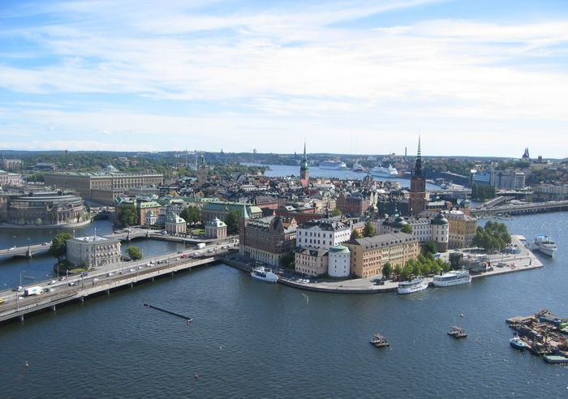

---
hide:
  - toc
---

# Home

## When and where is the Fall Collaboration 2018 meeting? 

The Fall 2018 IceCube Collaboration meeting is September 24-28, 2018 and will be hosted by [Stockholm University](https://www.su.se/english/) in Stockholm Sweden.
There will be pre-meetings on September 22 and 23.
Pre-meetings will take place at: [AlbaNova](https://www.albanova.se/) - Roslagstullsbacken 21.
Main meeting will take place at Stockholm University in these buildings:
[Aula Magna](https://www.su.se/english/about/campus/conferences/aula-magna) (Plenary sessions) - Frescativägen 6 and [Geo Building (Geovetenskapens hus)](https://www.humangeo.su.se/english/about-us/find-us/geo-science-building) (Parallel sessions) - Svante Arrhenius väg 8                         
 
For exact room locations in each building check indico and daily schedules near registration desk.

## Contact info
For questions regarding the conference, please email Ellie at : ellie.feitlinger@icecube.wisc.edu

