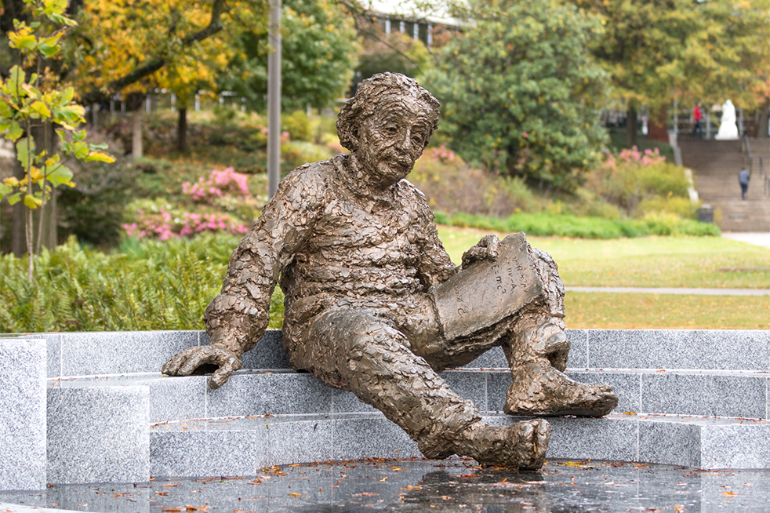

---
hide:
  - toc
---

# Home

{: align="left" style=""}

## When is the Spring Collaboration 2018 meeting?

The Spring 2018 IceCube Collaboration meeting is May 8-12, 2018.
There will be pre-meetings on May 5-7, 2018.
Current pre-meeting schedule:
Saturday May 5: Intro to GPGPU Computing Bootcamp
Sunday May 6: Gen-2 and Detector systematic uncertainty workshop
Monday May 7: Gen-2 and LowEn/Osc analysis workshop

{: align="left" style=""}

## Where is the meeting?

The IceCube collaboration meeting will be hosted by Georgia Tech in Atlanta, Georgia.
Pre-meetings and most of the meeting will take place at:
[Georgia Tech Student Center](https://studentcenter.gatech.edu/)
350 Ferst Dr NW, Atlanta, GA 30332
  
Thursday May 10 the meeting will take place at: 
[Howey Physics Building](http://www.physics.gatech.edu/)
837 State St. Atlanta, GA 30332 
 
For exact room locations in each building check indico and daily schedules near registration desk.
 
Note: A gym pass for a week at the [Georgia Tech Recreation Center](https://crc.gatech.edu/memberships) is available for $14.
If you're interested please email by Wed May 2 to ellie.feitlinger@icecube.wisc.edu

## Contact info
For questions regarding the conference, please email: collaboration@icecube.wisc.edu

