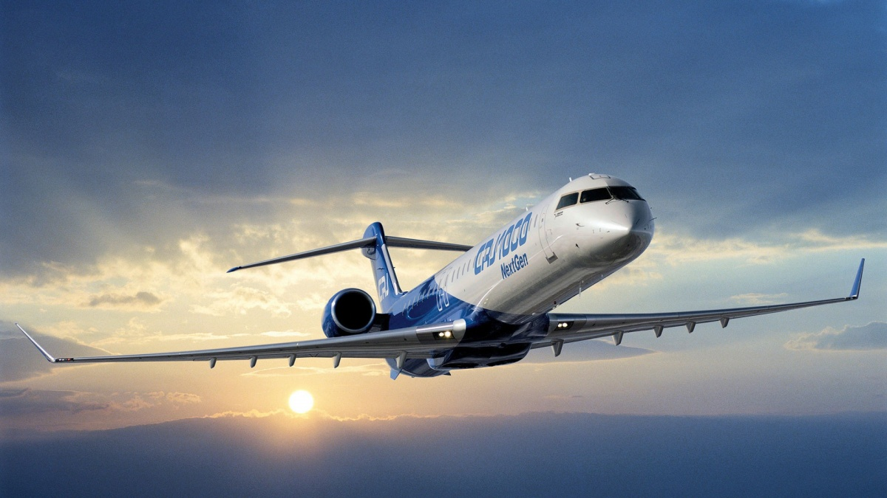

---
hide:
  - toc
---

# Home

## When is the Fall Collaboration meeting?

The 2017 Fall Collaboration meeting is October 2-6.
There will be pre-meetings for Polar Science on September 30th and Gen2 and other pre-meetings on October 1st.
The MANTs meeting will follow, October 7-8 in Marseille, France.
 
Guests who are ONLY attending the pre-meeting for Polar Science on September 30th please register and submit your talks here: [Polar Science Indico Page](https://events.icecube.wisc.edu/conferenceDisplay.py?ovw=True&confId=97)

[HELPFUL INFO DURING MEETING](https://drive.google.com/file/d/0B5115p0r4kMxQW8zNTV4NmtyZFE/view?usp=sharing)

### Where is the meeting?

It is situated in the heart of the capitol- close to the historical area "Unter den Linden"
[Humbolt-University of Berlin](https://www.hu-berlin.de/en/about/campus/campus-mitte/sites/dorotheenstrasse-24/dorotheenstrasse-24-universitaetsgebaeude-am-hegelplatz?set_language=en)
Dorotheenstr. 24
10117 Berlin
Please use the entrance Hegelplatz

{: align="left" style=""}

### How do I get to Berlin, Germany?

There are two airports in Berlin, [Schönefeld Airport (SXF)](http://www.berlin-airport.de/en/travellers-sxf/index.php) and [Tegel Airport (TXL)](http://www.berlin-airport.de/en/travellers-txl/index.php). Details on the [travel page](/travel.md). 

### MANTs meeting

The MANTs Meeting will take place in Marseille, France from October 7-8. [Indico Website](https://indico.cern.ch/event/661120/overview) (password protected). Fee for this meeting will be annouced soon.
