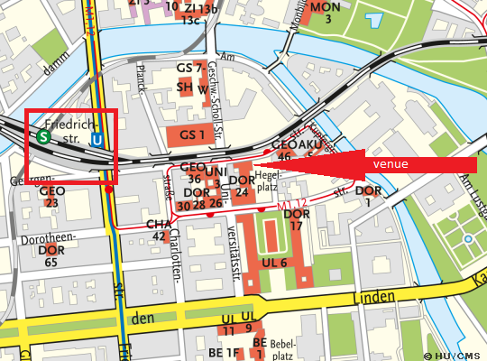

---
hide:
  - toc
---

# Location

## Map of Humboldt University of Berlin and map of surrounding area

All meetings will be held at 
[Humboldt University of Berlin](https://www.hu-berlin.de/en/about/campus/campus-mitte/sites/dorotheenstrasse-24/dorotheenstrasse-24-universitaetsgebaeude-am-hegelplatz?set_language=en)
Dorotheenstr 24
10117 Berlin
 
The entrance is located at Hegelplatz.
It takes you 5 minutes to walk from S Bahn and underground station FriedrichstraBe to the venue.
 

{ width="400" }

## Building Layouts for Collaboration Meeting

{ width="400" }

{ width="400" }

{ width="400" }

## Public transport in and around Berlin

At registration we will provide a public transportation ticket for all participants. This ticket wil allow you to use all public transportation in Berlin (fare zone AB) from September 30th through October 7th 2017. 

Download public transportation map: [HERE](https://meetings.wipac.wisc.edu/sites/meetings/files/images/VBB-Liniennetz.pdf)

[More public transportation tips](http://www.s-bahn-berlin.de/en/route-information)

