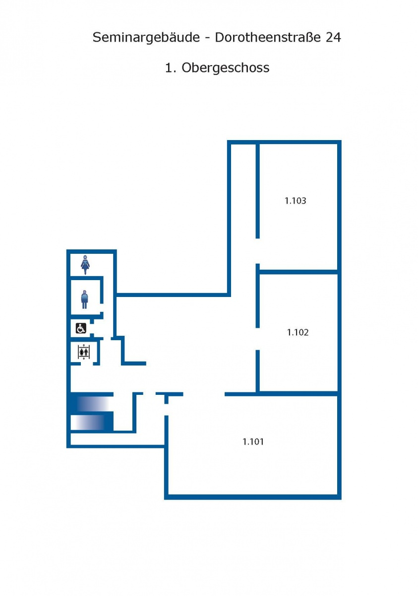

---
hide:
  - toc
---

# Schedule

## Schedule Overview:

Please see the IceCube [INDICO TIMETABLE](http://events.icecube.wisc.edu/conferenceDisplay.py?confId=90) for the detailed schedule. 
All meetings will be held on campus at
[Humboldt University of Berlin](https://www.hu-berlin.de/en/about/campus/campus-mitte/sites/dorotheenstrasse-24/dorotheenstrasse-24-universitaetsgebaeude-am-hegelplatz?set_language=en)
Dorotheenstr 24
10117 Berlin
 
Registration/Check in to the conference will be in the front room 1.102 (first floor)
All plenary sessions will be in room 1.101 

Parallel session rooms will change daily, please see program for more details.
Wireless access information will be provided when you pick up your registration materials on the first day of the meeting.
 

**Friday, Sept 29**

[Simulation Workshop](https://wiki.icecube.wisc.edu/index.php/Simulation_Workshop_Zeuthen_2017) (Pre-meeting)- Held at DESY Zeuthen

**Saturday, Sept 30**

[Polar Science Workshop](https://events.icecube.wisc.edu/conferenceDisplay.py?ovw=True&confId=97) (Pre-meeting)

**Sunday, Oct 1**

Gen 2 and other pre-meetings 

**Monday, Oct 2**

Collaboration Meeting begins, Welcome party

**Tuesday, Oct 3**

Collaboration Meeting, Evening lecture, Diversity Event

**Wednesday, Oct 4**

Collaboration Meeting, Comm Workshop, Professional Development/Mentoring event

**Thursday, Oct 5**

Collaboration Meeting, Banquet

**Friday, Oct 6**

Collaboration Meeting

**Saturday, Oct 7**

[MANTs meeting](http://indico.cern.ch/event/661120/overview) 2017 in Marseille, France

**Sunday, Oct 8**

[MANTs meeting](http://indico.cern.ch/event/661120/overview) meeting 2017 in Marseille, France

***For additional IceCube-related events check Social Events tab.***
