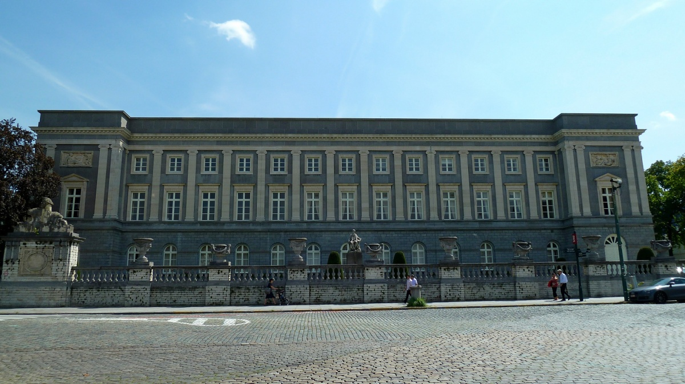
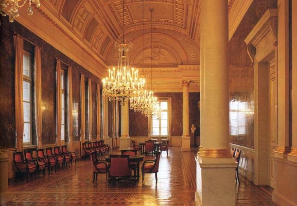
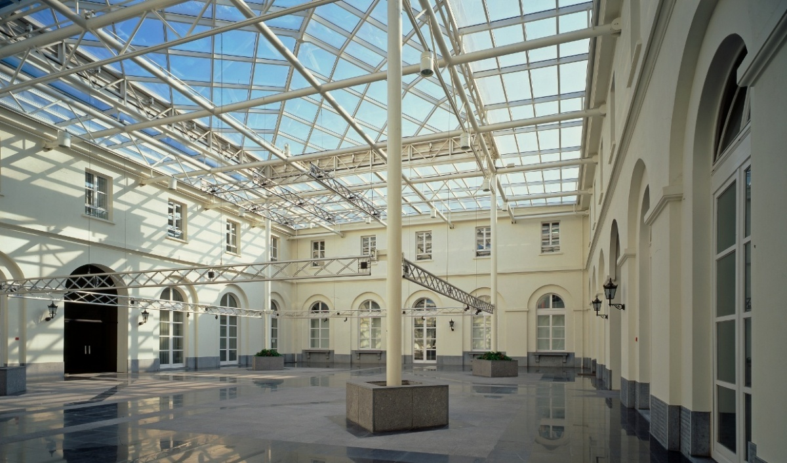

---
hide:
  - toc
---

# Location

### Venue Information

The meeting will be held at The Royal Academies for Sciences and the Arts of Belgium, located at:

Hertogsstraat 1/PALAIS ACAD, 1000 Brussel, Belgium
Venue in Brussels

For information on traveling to the Royal Academies, please refer to the [Travel](travel.md) page.
