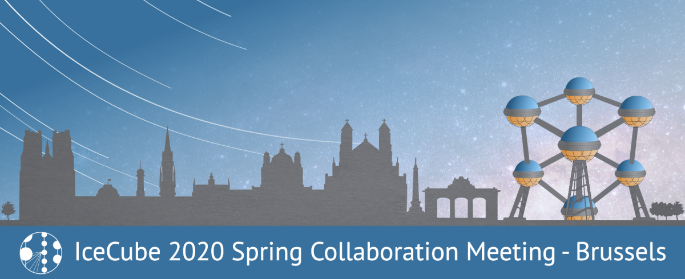

---
hide:
  - toc
---

# Travel Information

The Royal Academies for Sciences and the Arts of Belgium is located at the city center of Brussels, near many hotels and metro stations. Brussels is easy to reach by plane via Zaventem International Aiport or by train through Amsterdam, Paris, and Frankfurt.

**From Zaventem Aiport**, you can take a train directly into the city center of Brussels. More information [here](https://www.brusselsairport.be/en/passengers/access-parking/train).

The banquet venue, Hotel Le Plaza, is located just over a mile away from the meeting site and can be accessed in about ten minutes using the metro.

There are many cultural and sightseeing attractions nearby, such as the 15th Century Grand Place, Cinquantenaire Park, and Atomium (pictured below).

### Location of The Royal Academies for Sciences and the Arts of Belgium

Address: Hertogsstraat 1/PALAIS ACAD, 1000 Brussel, Belgium.