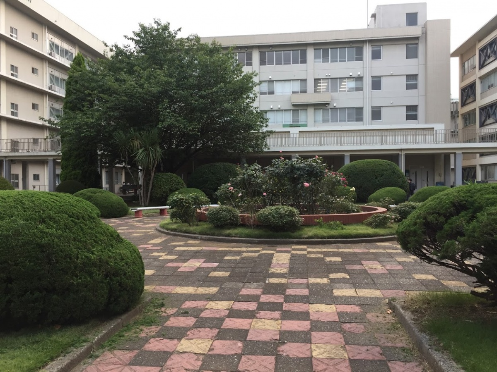
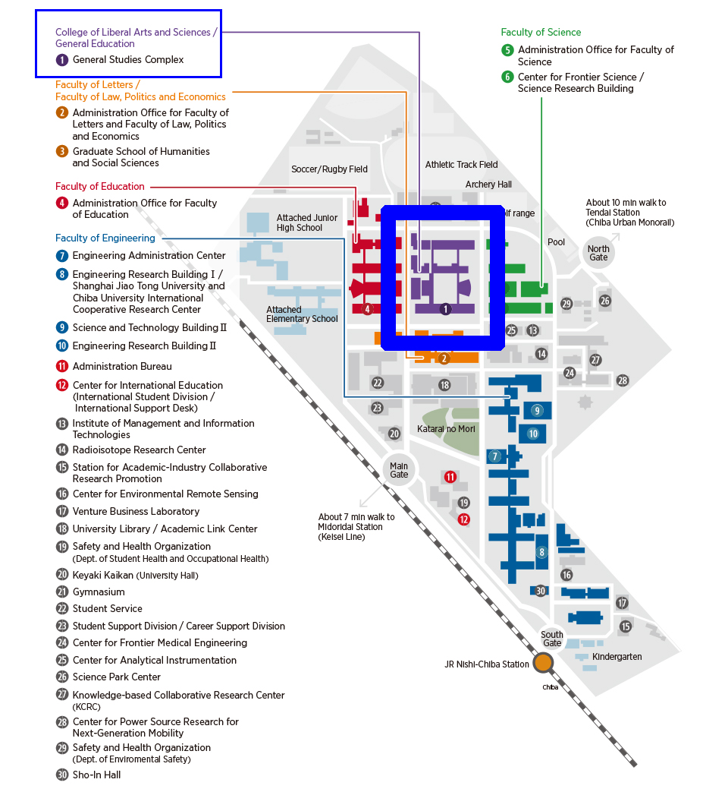
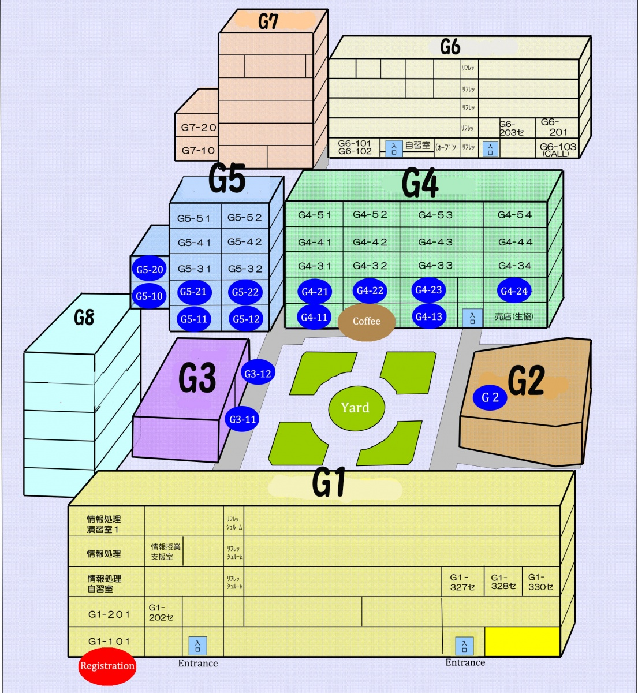
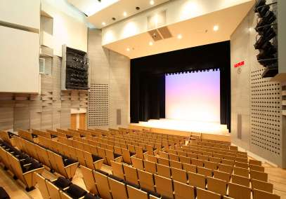
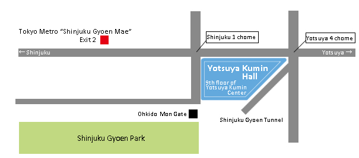
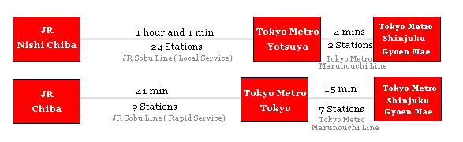

---
hide:
  - toc
---

# Venue Information

The meeting will be held at Chiba University – Nishi-Chiba Campus 1-33 Yayoi-cho, Inage-ku, Chiba-shi, Chiba, General Studies Complex. Registration will be handled at the entrance of Bldg. G1. All plenary sessions will be held in Bldg. G2, except for Thursday Sept. 18, where they will be held at Yotsuya Kumin Hall in Tokyo. Parallel session rooms change daily, please refer to the program for more details. Wireless is available through eduroam in all the rooms at the university and will be limited at the Tokyo venue.

## Venue in Chiba

For directions to Chiba University, please refer to the [Travel](/travel) page.

## Chiba University Map

## Venue for Tokyo (For Thursday, Sept. 19)

## Yotsuya Kumin Hall 

87 Naito-cho, Shinjuku-ku, Tokyo

## How to get to the Yotsuya Kumin Hall from Chiba Station: 

- [Chiba2YotsuyaFastest.pdf](Chiba2YotsuyaFastest.pdf) (it is easy/fast option)
- [Chiba2YotsuyaFastest-B.pdf](Chiba2YotsuyaFastest-B.pdf) (it is the fastest option)
- [Chiba2YotsuyaAvoidRush-hour-traffic.pdf](Chiba2YotsuyaAvoidRush-hour-traffic.pdf) (if you choose this option, you can avoid the terribly crowded train in the morning, but it takes time. You need to leave Chiba at 7:15.)
 

## How to get to the Yotsuya Kumin Hall from Nishi-Chiba Station: 

- [NishiChiba2YotsuyaFastest.pdf](NishiChiba2YotsuyaFastest.pdf) (it is the fastest option)
- [NishiChiba2YotsuyaAvoidRashhour.pdf](NishiChiba2YotsuyaAvoidRashhour.pdf) (if you choose this option, you can avoid the terribly crowded train in the morning, but it takes time.)

## Access:

Three minutes' walk from the exit 2 of Tokyo Metro "Shinjuku Gyoen Mae" station.

From Chiba or Nishi Chiba:

## For other routes:

Please refer to [Route Search Website](https://world.jorudan.co.jp/mln/en/) or Google Maps

## Cafes around Yotsuka Kumin Hall
[https://drive.google.com/open?id=1U5Gin8oJzNlY_SlJbg19PgRob-H_Sc7
](https://drive.google.com/open?id=1U5Gin8oJzNlY_SlJbg19PgRob-H_Sc7)

