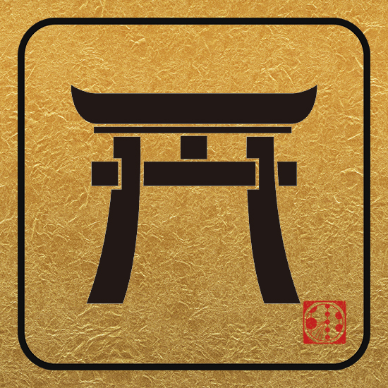

---
hide:
  - toc
---

# Lodging

**Please note, we are past the August 10th deadline to book a room at the discounted group rate.** If you submitted your request to collaboration@icecube.wisc.edu before the deadline, we will do our best to accomodate your hotel and room choice, though options are limited.

By mid-August, anyone who booked through us should receive a confirmation email directly from their hotel. Please check this thoroughly for accuracy to ensure you have the correct arrival and departure dates.

If you need to make changes to your reservation or if you have specific questions about your reservation, you must contact your hotel directly (do not email collaboration @ icecube.wisc.edu). 

Payment for your hotel room will need to be paid at the time of check-in. 

## Resources to book your hotel on your own:

[Chiba Area](https://www.tripadvisor.com.ph/Hotels-g298158-Chiba_Chiba_Prefecture_Kanto-Hotels.html)

[Tokyo Area](https://www.tripadvisor.com.ph/Hotels-g298184-Tokyo_Tokyo_Prefecture_Kanto-Hotels.html)

If you are interested in experimenting capsule hotels:

- [Capsule Hotel & Sauna Noble Capsule Hotel The Inn](https://www.booking.com/hotel/jp/kapuseruhoteru-sauna-noburu.html?aid=356980;label=gog235jc-1FCAYYlQQodUIFY2hpYmFIM1gDaHWIAQGYARW4ARfIAQzYAQHoAQH4AQyIAgGoAgO4Apj4oOgFwAIB;sid=b4f7e4826c8ad602f6817ba06bc12670)

- [Capsule Hotel The Inn](https://www.booking.com/hotel/jp/zainqian-xie.html?aid=356980;label=gog235jc-1FCAYYlQQodUIFY2hpYmFIM1gDaHWIAQGYARW4ARfIAQzYAQHoAQH4AQyIAgGoAgO4Apj4oOgFwAIB;sid=b4f7e4826c8ad602f6817ba06bc12670)

