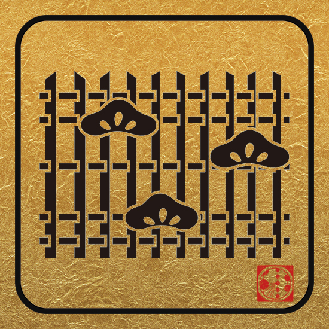

---
hide:
  - toc
---

{: align="left" style=""}

# Schedule

**Friday, September 13**

Tour of Hamamatsu PMT factory *If you signed up

**Saturday, September 14**

Pre-meetings at CU campus; Diffuse workshop in Tokyo *Indico link here

**Sunday, September 15**

Pre-meetings; Diffuse workshop in Tokyo 

**Monday, September 16**

Plenary sessions AM, Parallel sessions PM and welcome party

**Tuesday, September 17**

Plenary sessions AM, Parallel sessions PM

**Wednesday, September 18**

Parallel sessions AM, Parallel sessions PM

**Thursday, September 19**

Meetings held in Tokyo ( @ Yotsuya Kumin Hall ); Plenary sessions AM , Plenary sessions PM; Banquet Night in Tokyo

**Friday, September 20**

Plenary sessions AM

## Additional Meetings:

**Science Communication Workshop: Wednesday, September 18 @12:30-14:30**

In this lunch time science communication workshop, Ms. Akimoto and Ms. Lu will talk about their experiences communicating science to the public through two very different mediums - anime and augmented reality respectively.

**Women + Allies Networking Happy Hour: Wednesday, September 18 @18:30-20:30 (location TBD)**

**Detailed Schedule: available on [Indico](https://events.icecube.wisc.edu/event/112/timetable/#20190913)**

