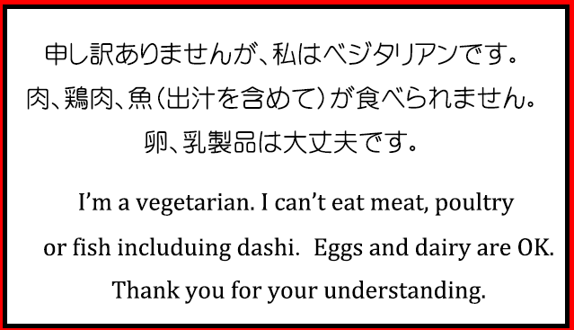
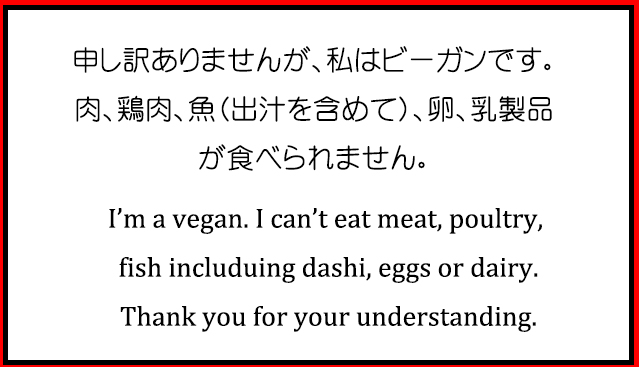

---
hide:
  - toc
---

{: align="left" style=""}

# Tips & Suggestions

### From the Chiba team, here are some useful tips and some suggestions to help make your stay in Japan as comfortable as possible:

- Using the GPS may be helpful as Japanese addresses are difficult to navigate; Japanese addresses are block-based, not a street base. Google maps are always very helpful to locate your destination. It is kept well up-to-date. (You may need a backup battery considering the use of GPS drains the battery very quickly unless you have the newest smartphones.)
- Some restaurants do not carry their menu in English.  In that case, Google Translate installed on your phone is very helpful. It has a nice feature where you can take a picture of text, it will identify the characters and translate to your language of choice (quality can vary). You won’t need any Japanese reader explaining you what is in the menu!
- If you buy something at a store, they will most likely put your purchases in a plastic bag fairly quickly without asking you. If you don't want one, pay attention and mention it quickly. The Earth will thank you. You can say “Fukuro Irimasen” to say no to the bag.
- IC cards, like the ones called Suica, may be useful during your stay. For instance, you can buy the Suica card at a ticket vending machine at the JR station. You can use the card to pay the fee of the train or bus and to pay at some stores, and Chiba Univ. cafeteria accepts the Suica card as well. To purchase the card, you need to pay the deposit of 500 yen and charge the amount of money you wish. When you return the card to “Midori no Madoguchi” ticket office at a rather large JR station, they will refund the money charged in your card including your deposit with the handling fee of 220 yen. For more details on how to use the card, please refer: https://www.thejapanguy.com/using-your-suica-card-and-pasmo-card/
- You will see several convenient stores all over the town in Chiba/Tokyo. The stores are opened for 24 hours a day, and it is a good place to go if you need to get some take-out or snacks to eat. People here call them, Convini; the main ones are Family Mart (Famima), Lawson, Seven-Eleven(Seven), and Mini-Stop. Here is some useful Japanese phrases when you shop at the Convini.

### Things you are likely asked at the Convini:

- Fukuro wa Irimasuka? – Do you want a bag?
- Obento o Atatame Masuka? – May I warm your take-out (meal)?
- Pointo kaado wa Arimasuka? – Do you have a point card?
- Reshiito wa Irimasuka? – Do you need your receipt?

### The ways you respond:

- Hai - Yes
- IIe - No
- Wakarimasen – I have no idea what you are saying.
- Daijobu – No problem or I am OK without it (a plastic bag or receipt).
- Fukuro Irimasen - I don’t need a bag.
- Atatame Onegaishimasu - Will you warm it up for me?

If you are a vegetarian, it is sometimes hard to find restaurants which carry the vegetarian-friendly menus, but you can always ask them to suggest you the menu which doesn’t contain non-vegetarian products. The cards below may help you to communicate with them easier. What you may want to watch out is Dashi, the stock. For instance, you can find many varieties of tofu menu at the restaurants in Japan, but the dashi soup or sauce served with the tofu may be made from fish or meat.

{: align="left" style=""}
{: align="left" style=""}

You don’t leave any tip at restaurants as this is not a custom in Japan.  However, it will still be wise to carry some cash since some stores and restaurants don’t accept credit card payment. You can easily find ATM which you can use with your international bank card. They usually have the button to change the information shown in English. https://www.sevenbank.co.jp/intlcard/service2.html

When you are at a restaurant, you may want to call waiters if you want to be helped. After you made an order, they don’t come to check on you to see if you need help in the same manner the waiters do in the US. Some restaurants leave a button on each table for customers to push when they need help. Other restaurants may expect you to call them by saying “Sumimasen” (Excuse me).  Making payment at the table is getting more and more familiar in Japan, but you can also go to their check desk.
