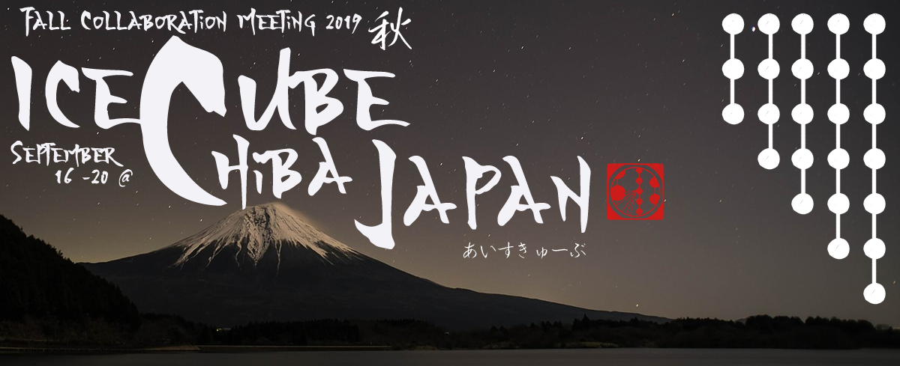
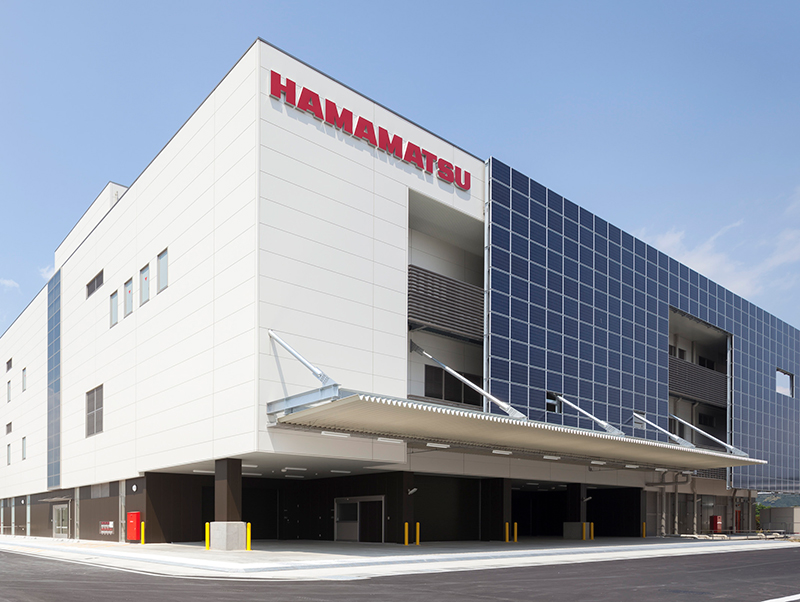
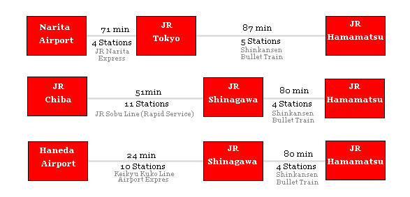

---
hide:
  - toc
---

{: align="left" style=""}

# Tour of Hamamatsu Photonics

50 seats available on the chartered bus from Hamamatsu Station to Toyooka factory of Hamamatsu Photonics.

Hamamatsu cannot accommodate more than 50 guests on this tour. To attend, you must be registered. *Please note: we have six spaces available on the Hamamatsu tour. If you would like to RSVP, please email mtakahashi@chiba-u.jp.

Hamamatsu Photonics Toyooka Factory

*Courtesy of Hamamatsu Photonics K.K.*

**Address**

314-5, Shimokanzo, Iwata City, Shizuoka Pref.,438-0193, Japan

**Phone: (81)539-62-3151**

[https://www.hamamatsu.com/jp/en/our-company/global-organizations/japan/toyooka-factory/index.html](https://www.hamamatsu.com/jp/en/our-company/global-organizations/japan/toyooka-factory/index.html)

**Date and Place to Meet:**

Friday, September 13 @ Hamamatsu Station, South Exit 

Guests are responsible for their own travel to Hamamatsu Station

**Time:** 11:50am

Please have lunch beforehand

**Schedule:**

12:00  Leaving for Toyooka Factory by chartered bus

13:00  Arrival at the factory; 2 groups formed to go on a tour of the factory and the exhibition room

15:30 or 16:00  Leaving the factory

16:30 or 17:00  Arrival at Hamamatsu Station

**Access to Hamamatsu Station:**

If you arrive with early flight, it is possible to go straight from the airport to Hamamatsu station, but arriving a night before is recommended.

**Hotels in Tokyo:**

If you consider staying in Tokyo the night before, staying near Tokyo or Shinagawa station may be more convenient to catch the Shinkansen Bullet Train.

[https://www.booking.com/city/jp/tokyo.html
](https://www.booking.com/city/jp/tokyo.html)

**Hotels in Hamamatsu:**

If you would like to stay in Hamamatsu the night before, there is a selection of several hotels near Hamamatsu station.

[https://www.hotels.com/de725491/hotels-hamamatsu-japan/?pos=HCOM_ASIA&locale=en_JP
](https://www.hotels.com/de725491/hotels-hamamatsu-japan/?pos=HCOM_ASIA&locale=en_JP)

