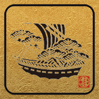

---
hide:
  - toc
---

{: align="left" style=""}

# Travel Information

Chiba University is conveniently located in the Tokyo metropolitan area with great access from Tokyo Station and Narita International Airport, and less than one hour by car or train from either. The university also stands near the Boso Peninsula and Tokyo Bay, offering both the excitement and convenience of a major metropolitan city and the calm beauty and nature of the countryside.

Makuhari Messe, an international conference and event facility, as well as, Kazusa Akademia Park, Tokatsu Techno Plaza, the National Museum of Japanese History, and Tokyo Disney Resort are only a short distance away.

## Chiba Basic Information

### Weather:

Chiba Prefecture is surrounded by the sea on its three sides and has a humid subtropical climate, cool to mild in winter and very hot in summer. September is warm to hot.

[Chiba-shi September Weather](https://www.accuweather.com/en/jp/chiba-shi/223069/september-weather/223069)

## Location of Chiba University

Address: 1-33 Yayoi-cho, Inage-ku, Chiba-shi, Chiba

There are two International Airport in Tokyo/Chiba area, Narita and Haneda. The closest one to Chiba University is Narita airport. If you stay in Tokyo area, Haneda may be more convenient.  Please refer to the table below on how to get to Nishi-Chiba Station, the closest station to Chiba University, from each airport.

###  For other routes:

Please refer to [Route Search Website](https://world.jorudan.co.jp/mln/en/) or Google Maps

### Access:

2-min walk from JR Nishi-Chiba Station to the South Gate of Nishi-Chiba Campus

7-min walk from Keisei Midoridai Station to the Center Gate of Nishi-Chiba Campus

10-min walk from Chiba Monorail Tendai Station to the North Gate

## Area Information and Places to Visit

Chiba and Tokyo have a wide variety of fun places to visit. Feel free to try any of the recommended places during your time in the city.

### Chiba Area:

- [Chiba Shrine](https://en.japantravel.com/chiba/chiba-shrine/3324)
- [Chiba City Fish Market on Sep.14](http://www.chibauo.jp/access.html)
- [Chiba Port Tower](https://chiba-porttower.com/)
- [Chiba Port Night Cruise to see view of factories](http://www.chiba-port.com/%E5%B7%A5%E5%A0%B4%E5%A4%9C%E6%99%AF%E3%82%AF%...)
- [Chiba Park](https://en.japantravel.com/chiba/chiba-park-in-autumn/33350)
- [Chiba City Folk Museum](http://japan-chiba-guide.com/sys/data/index/page/id/18328/)
- [The World's Longest Suspended Monorail](http://japan-chiba-guide.com/sys/data/index/page/id/18326/)
- [Harbor Circuit Indoor Karting](https://en.japantravel.com/chiba/harbor-circuit-indoor-karting/1311)
- [Inage Seaside Park](https://en.japantravel.com/chiba/sunset-at-inage-seaside-park/23924)
- [Japanese Garden in Makuhari ](http://japan-chiba-guide.com/sys/data/index/page/id/18325/)
- [Mall Makuhari New City](https://en.aeonmall.global/mall/makuharishintoshin-aeonmall/)

### Tokyo Area:

- [Tokyo Tower Highball Garden rooftop]( https://www.tokyotower.co.jp/event/attraction-event/highball-garden2019/...)
- [Golden Gai](https://www.roughguides.com/article/tokyos-tiniest-drinking-dens-a-guide...)
- [Team Lab Exhibitions](https://www.team-lab.com/)
- [Yanaka, the old fashioned Shopping Street](https://jw-webmagazine.com/yanaka-ginza-tokyos-best-old-fashioned-shoppi...)
- [Tsukishima Monja Street](https://jw-webmagazine.com/tokyos-hidden-gourmet-gem-tsukishima-monja-st...)
- [Onsen Entertainment](https://daiba.ooedoonsen.jp/en/)
- [EDONOREN, fun place to eat](http://www.jrtk.jp.e.wz.hp.transer.com/edonoren/)
- Their English page doesn't seem to be ready, but this is a very nice event which happens to be held until the week of our meeting. Highly recommend, especially their Gold Fish exhibition! [Eco Edo Nihonbashi](https://www.nihonbashi-tokyo.jp/en/ecoedo2019/)

### Check out these links for more events or places to visit in Chiba/Tokyo during the meeting:

- [japan-guide.com](https://www.japan-guide.com/)
- [JAPAN INFO](https://jpninfo.com/)
- [Chiba, Japan Travel Guide](http://japan-chiba-guide.com/)
- [Chiba Convention Bureau and International Center](https://www.ccb.or.jp/mice/e/why-chiba/about-chiba/event/)
- [Go Tokyo](https://www.gotokyo.org/)
