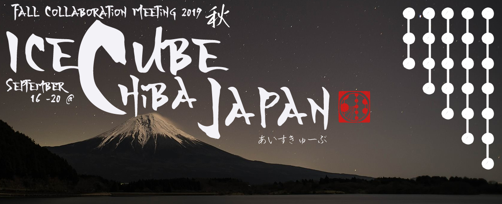

---
hide:
  - toc
---

{: align="left" style=""}

# Useful Japanese Phrases

- Sumimasen – Can be used as “I am sorry,” “Excuse me,” and “Thank you.”
- Konnichiwa – Hello!
- Arigato – Thanks!
- Sayonara - Goodbye
- Otsukaresama (-deshita) - Goodbye when you leave from work.
- Gomen Nasai – I am sorry.
- Onegai Shimasu – Please or Can I have….?
- Biiru o Onegai Shimasu – Can I have a beer?
- Edamame Arimasuka? – Can I order Edamame?
- Itadakimasu - A phrase you say before starting your meal
- Gochisousama (-deshita) - A phrase you say after your meal; can be used as “thank you“ when you leave the restaurant.
- Kore Onegaishimasu – Can I have this? (as you are pointing something on menu or at store)
- Ryoshu-sho Kudasai – Can I have a receipt?
- Chiba Daigaku wa Doko Desuka? – Where is Chiba University?
- Sou Sou Sou Sou – yes, yes, yes ,yes
- Nyutorino no Kenkyu o Shiteimasu – I am doing research on Neutrino!
- Watashi wa Kagakusha Desu - I am a scientist.
- Aisukyuubu - IceCube
- Sugoi! - Excellent! Super!
- Shinjirarenai! - Unbelivable!
- Tanoshikatta! – I enjoyed it!
- Oishikatta! - It was delicious!
- Honto? - Really?
- Uso! - Don’t lie to me!; No way!; Are you kidding me?; Hard to believe!
- Nihongo ga Wakarimasen - I don’t understand Japanese.
- Eigo o Hanasemasuka? - Do you speak English?
- Eigo no Menyu Arimasuka?  - Do you have a menu in English?
