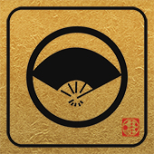
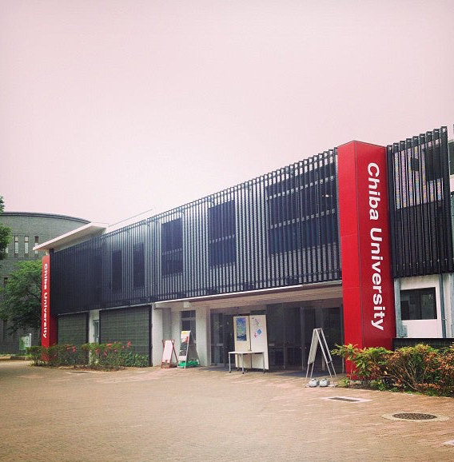
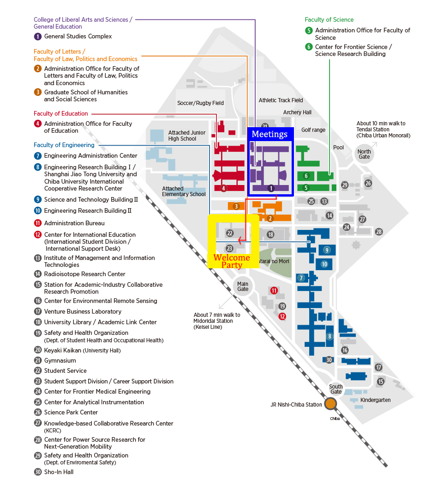
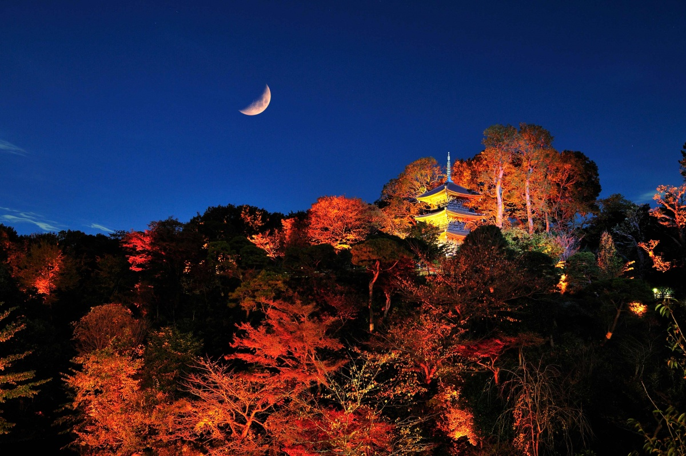

---
hide:
  - toc
---

{: align="left" style=""}

# Welcome Party & Banquet

## Welcome Party

The welcome party for the Collaboration meeting will be held on Monday, September 16th at the Active Student Learning Center, from 6:00-8:00pm.  An assortment of appetizers will be provided as well as drink tickets for the bar.

### Welcome Party Venue

{: align="left" style=""}

{: align="left" style=""}

## Banquet

The collaboration banquet will be held on Thursday, September 19th at Hotel Chinzanso Tokyo in the room “Miyabi." The cost of the banquet is included in the price of the conference. The IceCube collaboration banquet starts with a reception from 6:00-7:00pm, and dinner at 7:00pm. Welcome Drink will be served from 6:00pm. Your first drink is included to the banquet. More drinks are available to be paid in cash at the bar.

{: align="left" style=""}

### Hotel CHINZANSO Tokyo – Room “Miyabi” on 4th floor of Plaza (Banquet Bldg.)

10-8, Sekiguchi 2-chome, Bunkyo-ku, 112-8680 Tokyo Japan

https://www.hotel-chinzanso-tokyo.com/
