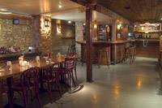
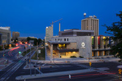

---
hide:
  - toc
---

# Home

{: align="left" style=""}

## Welcome Party, Monday May 6!

Posted: 13 February 2013
Following up the success of the welcome party in Aachen last fall, we will host our own the Monday night before the meetings start. We don’t have any castles to show off, so we’ll be hanging out at the Great Dane Pub & Brewing Company. More details coming soon

{: align="left" style=""}

## IceCube Particle Astrophysics Symposium (IPA2013)

Posted: 11 February 2013
IPA2013 will be held Monday, May 13 to Wednesday, May 15. We have a great line-up of plenary talks planned and parallel sessions are being organized. Check out the site to see speaker lists and submit an abstract.

{: align="left" style=""}

## Reserve your hotel now

Posted: 3 February 2013
Several new and interesting accommodation venues are available this year. Visit the hotels page to reserve your room now. If you are looking for special arrangements, please contact us.