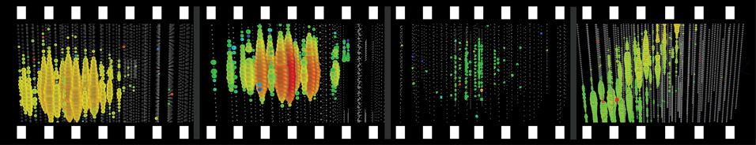

---
hide:
  - toc
---

# Location

## Building Maps
The meeting will be held at Union South, 1308 W Dayton St.
 
## Wireless
Wireless is available with eduroam or with UW guest access accounts. 
Access accounts will be provided with registration materials.
 
## WebEx
Plenary sessions will be streamed through WebEx. 
WebEx connection information will be sent via icecube-c before the collaboration meeting.

## Area Information

Check out these links for more events in Madison during the meeting:
• [Madison Visitor Guide](https://mydigitalpublication.com/publication/?m=39908&l=1&p=&pn=#{%22issue_id%22:524167,%22page%22:0})
• [Campus Visitor Information](http://vip.wisc.edu/)
• [Madison Craft Beer Week](http://www.madbeerweek.com/)
• [Restaurant Guide](https://docushare.icecube.wisc.edu/dsweb/Get/Document-73490/IceCubeCollab_restaurants.pdf)