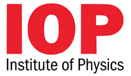
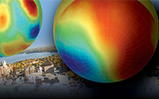
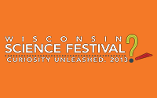

---
hide:
  - toc
---

# Home

## CRA Proceedings to appear in IOP Conf. Series
Proceedings for the CRA workshop with be published online in IOP Conference Series. Please download the template and fill out the release form. Presentations should be 8 pages maximum and overviews 12 pages. Proceedings are due January 31, 2014. Contact Kim with any questions.

Register Now
Rates for the Cosmic Ray Anisotropy workshop increase after Aug 23rd. Register now to lock in the early registration rate.

David Benyamin presents at NPAC forum
On Wednesday, September 25 at 2:30pm, David Benyamin from the Racah Institute of Physics at the Hebrew University of Jerusalem will give a talk on ["Cosmic Ray Diffusion in a Dynamic Milky Way: Recovering the observed B/C ratio in a spiral-armed cosmic ray propagation model"](http://www.physics.wisc.edu/twap/view.php?id=3040&name=NPAC) Benyamin, who is also presenting at CRA2013, will give the seminar at the NPAC (Nuclear/Particle/Astro/Cosmo) Forum, held in 4274 Chamberlin Hall, the home of the UW-Madison Department of Physics.

Wisconsin Science Festival in Madison Sept. 26-29
Explore and celebrate science at the [Wisconsin Science Festival](http://www.wisconsinsciencefest.org/). WIPAC is hosting Suds and Spirits Science Trivial on Friday afternoon, other special events to check out: stargazing at the Washburn Observatory and a live radio broadcast of Science Friday with Ira Flatow.

[Download the conference poster](cra2013-poster.pdf)
