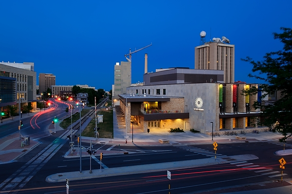

---
hide:
  - toc
---

# Home

The fall 2014 Fermi-VERITAS-HAWC workshop will be held in Madison, WI, at Union South on October 8 and 9.

This is the second Fermi-VERITAS-HAWC workshop.  The first one was held at the University of Maryland, College Park, on February 11 and 12, 2014.  The idea of these workshops is to increase understanding of each collaboration's data-flow process with an eye towards joint efforts.  The workshop will be of particular interest, but is not limited to, the analysis of time-domain astrophysics events such as GRBs and AGN flares.  Other topics include joint analysis tools for multiwavelength studies.
 
Meeting Contacts: 
- Petra Hüntemeyer (Michigan Tech, HAWC)
- Jeremy Perkins (NASA/GSFC, Fermi-LAT)
- Andrew W. Smith (University of Maryland, VERITAS)
- Stefan Westerhoff (UW-Madison, HAWC)

