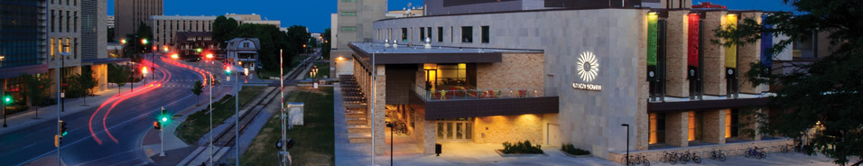
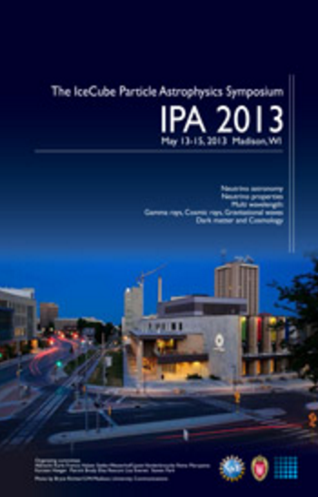

---
hide:
  - toc
---

# Home

With the IPA Symposium, WIPAC revives the historic Telemark meetings on neutrino physics. The topics include neutrino astronomy and related multiwavelength messengers (cosmic rays, high-energy gamma rays, gravitational waves), neutrino properties (including accelerator-based experiments), and related cosmological and dark matter aspects of particle astrophysics. The format will follow that of the Madison Pheno meetings with morning plenary talks and afternoon parallel sessions.

## Confirmed plenary session talks include:
- Trevor Weekes, Overview and History of TeV Gamma-Ray Astronomy
- Giorgio Gratta, Overview of Double Beta-Decay Experiments
- Yvonne Wong, Cosmology and Neutrino Mass Constraints
- Jordon Goodman, Results from Milagro and Status of HAWC
- Nathan Whitehorn, Results from IceCube
- Jenny Thomas, Overview of Accelerator Neutrino Experiments
- Keith Bechtol, Results from Fermi
- Günter Sigl, Origin and Acceleration of Cosmic Rays
- Paul Sommers, Ultrahigh-Energy Cosmic Rays
- Sarah Church, The Planck Mission
- Brian Humensky, CTA and the Future of High Energy Gamma-Ray Astronomy
- Stefan Schoenert, Overview of Solar Neutrinos
- Tao Han, University of Pittsburgh
- Antonio Jesus Melgarejo Fernandez, Columbia University
- Lauren Hsu, Fermilab Center for Particle Astrophysics
 
## Parallel sessions and conveners:
 
Neutrino Theory
- Dan Hooper, Fermi National Laboratory
High-Energy Gamma Ray Astrophysics
- John Pretz, Los Alamos National Laboratory
Cosmic Rays (Theory/Experiment)
- Doug Bergman, University of Utah
- Dark Matter (Theory/Experiment)
- Carsten Rott, Center for Cosmology and AstroParticle Physics at Ohio State University
Neutrino Astrophysics
- Markus Ahlers, Wisconsin IceCube Particle Astrophysics Center and University of Wisconsin
Accelerator-Based Neutrino Physics
- Zelimir Djurcic, Argonne National Laboratory
- Teppei Katori, Massachusetts Institute of Technology
Non-Accelerator-Based Neutrino Physics
- Lisa Kaufman, Indiana University
- Wei Wang, The College of William & Mary

[PDF version of event poster](ipa2013-poster.pdf)

