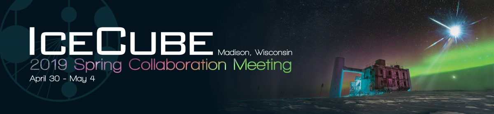

---
hide:
  - toc
---

# Home

### Registration Now Open

Registration and payment pages are now open. Meeting registration is completed using [Indico](https://events.icecube.wisc.edu/conferenceDisplay.py?confId=106). You may need to sign up for an account if you don't have an IceCube LDAP or an Indico login.

{: align="left" style=""}

### Reserve Your Hotel

Several new and interesting accommodation venues are available this year. Visit the [Lodging page](lodging.md) to reserve your room now. If you are looking for special arrangements, please [contact us](contactus.md).
