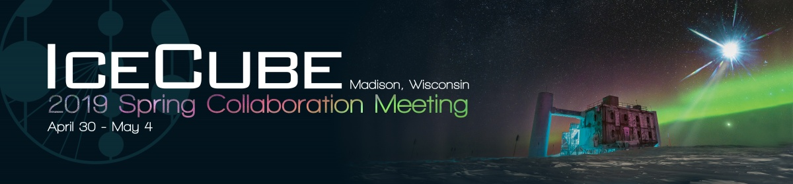
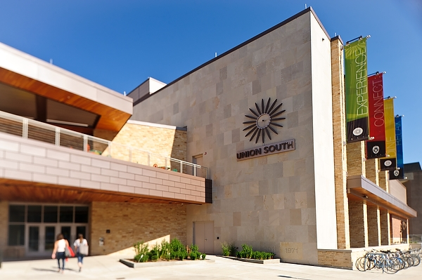
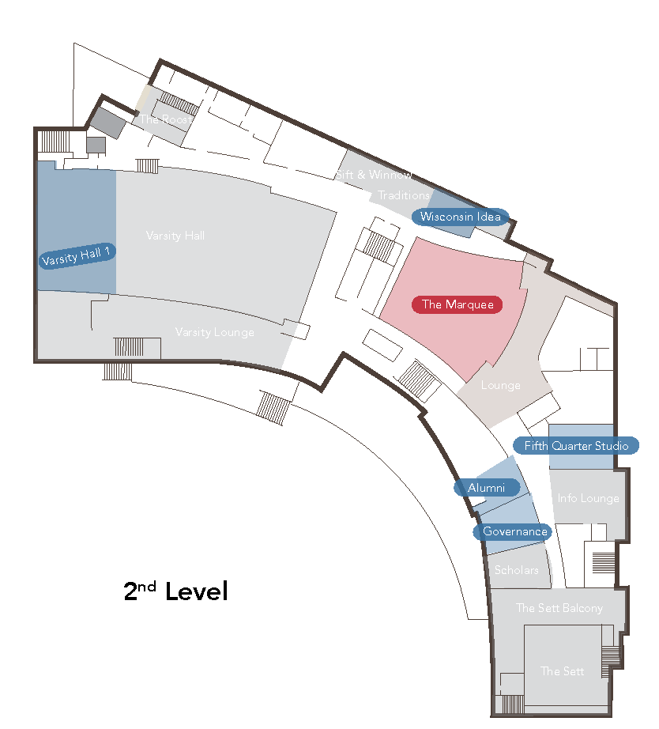

---
hide:
  - toc
---

# Venue Information

The meeting will be held on the University of Wisconsin—Madison campus at Union South, 1308 W Dayton St. in downtown Madison. Registration will be in the Alumni room on the second floor. All plenary sessions will be in the Marquee Theater, also on the second floor of Union South. Parallel session rooms change daily, please see the program for more details. Wireless is available through eduroam or with UW guest access accounts. Access accounts will be provided with registration materials on the first day of the meeting.

# Travel Information

Madison is home to the Dane County Regional Airport (MSN), but can also be accessed via bus service if you fly into O’Hare Airport in Chicago, IL (ORD) or Mitchell Airport in Milwaukee, WI (MKE). If you fly directly into Madison, taxi service is located at the north end of the baggage claim at Door 7. Taxi fare to downtown is approximately $25.00 including tip. Many Madison hotels offer pick-up and drop-off shuttle service. If you arrive at Chicago O’Hare Airport, the Van Galder Bus Company offers regular service to the Chazen Museum near downtown Madison. The bus trip is approximately 3.5 hours. If you arrive at Mitchell Airport, Badger Coaches offers buses from the airport to the Chazen Museum. The bus trip to Madison takes about 2 hours.

# Area Information and Events

Madison has a wide variety of community events. Feel free to attend any of the recommended events during your time in the city. 

Event info coming soon!
 
Check out these links for more events in Madison during the meeting:
• [Madison Visitor Guide](https://mydigitalpublication.com/publication/?m=39908&l=1&p=&pn=#{%22issue_id%22:524167,%22page%22:0})
• [Campus Visitor Information](http://vip.wisc.edu/)
• [Madison Craft Beer Week](http://www.madbeerweek.com/)
• [Restaurant Guide](https://docushare.icecube.wisc.edu/dsweb/Get/Document-73490/IceCubeCollab_restaurants.pdf)