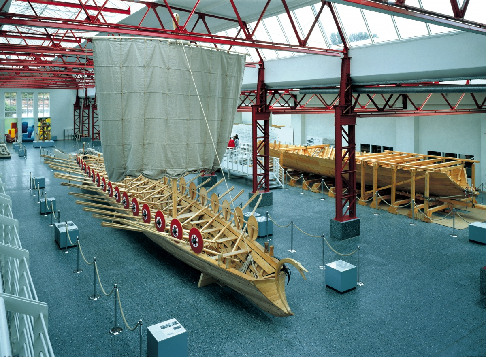
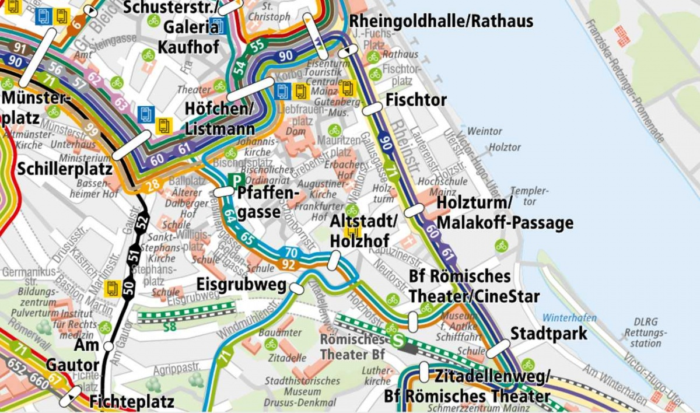
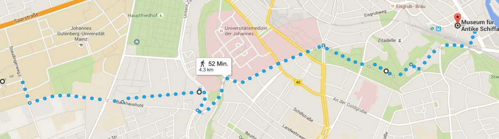
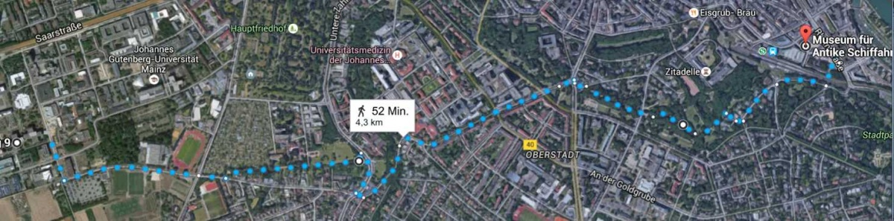
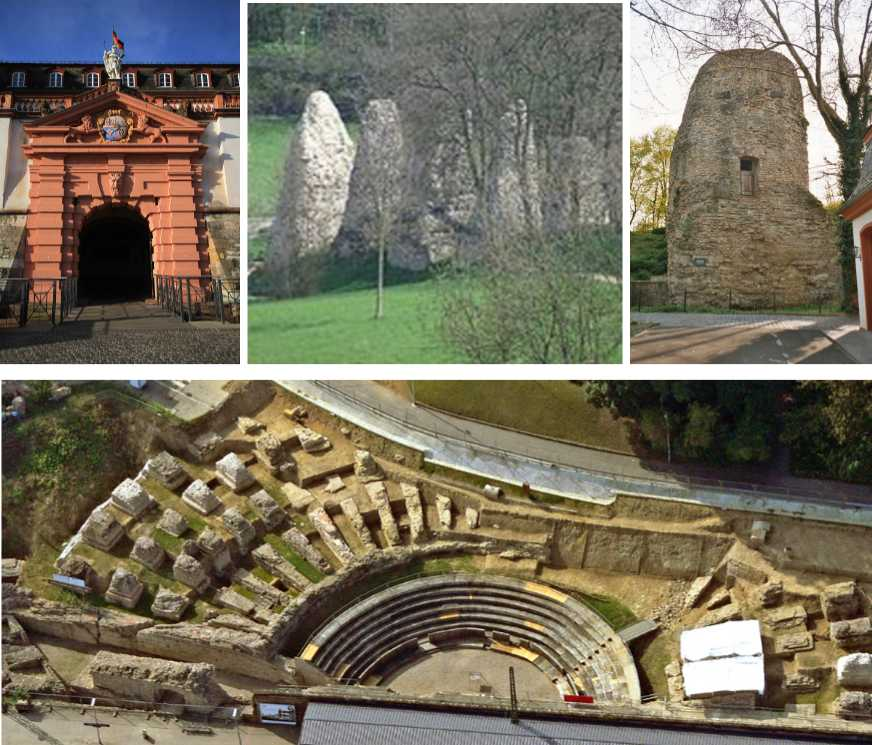

---
hide:
  - toc
---

# Welcome Party & Banquet

## Welcome Party 

The welcome reception will be at the Museum für Antike Schiffahrt Neutorstr. 2b,  55116 Mainz on Monday, 26 of September at 19:30.

## Collaboration Banquet

The banquet will be at Eisgrub Mainz, Weißliliengasse 1A, 55116 Mainz, on Thursday, 29 of September at 19:30.

### Bus and train stations close to Reception and Dinner locations 

We will have two official events accompanying the meeting. On Monday evening (26/9) starting 7:30 pm / 19:30, we arranged for a Welcome Reception at the Museum for Ancient Seafaring. You can either get there by bus (it will take about 20-30 min) or walk (see below). 

There are bus connections to the Welcome Reception (Museum for Ancient Seafaring / Römisches Theater) every 10-20 min. The same goes for the trip to the collaboration dinner at the Eisgrub brewery. When you start from the meeting location, you will need to change bus or train at least once (typically at the main train station). The trip will take 20-30 min. 

The last connection from the bus stop Staudingerweg will be at 7:02 pm (bus 69) and around the same time from Friedrich von Pfeiffer.Weg (bus E). Change to train RB75 at the main train station, exit train at Mainz Süd station. From there it is 2 min by foot to the Reception and 5 min to the dinner at the Eisgrub brewery. Since the bus capacities are limited, it goes without saying that it would be advisable to also take advantage of earlier busses.  

### Roman walk to Welcome Reception

Mainz (Roman name: Mogontiacum) has a long [history](http://www.livius.org/articles/place/mogontiacum-mainz/) and was an important military base in Roman times. If weather permits and you are up to a 50-min hike, you can join Lutz to walk to the Welcome Reception at the Roman Ship Museum, which is officially called “Museum für Antike Schifffahrt”.

We will leave around 18:20 from the meeting and walk past the ruins of a [Roman aqueduct](http://romanaqueducts.info/aquasite/mainz/index.html) (called “Römersteine”), a monument to the founder of [Mogontiacum Drusus](https://en.wikipedia.org/wiki/Drususstein), the [Mainz Citadel](https://en.wikipedia.org/wiki/Mainz_Citadel), the [Roman amphitheater](http://www.live-like-a-german.com/points_of_interest/show/632/mainz/the-mainz-roman-amphitheater) and will end up in  the [“Museum of Ancient Seafaring”](http://www2.rgzm.de/navis/musea/mainz/navismusengl.htm) (Roman ship museum). 

Remember that “Mainz is not a second Rome”, so don’t expect spectacular intact buildings … building material from Roman remains made building affordable for locals over many generations ... 

Some sights on the way: (credits Wikipedia, Generaldirektion Kulturelles Erbe Rheinland-Pfalz, Landesarchäologie Mainz)

