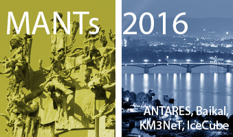

---
hide:
  - toc
---

# Home

{: align="left" style=""}

## When is the Fall Collaboration meeting?
2016 Fall Collaboration meeting will be held in Mainz, Germany from Sept 26-30 with pre-meetings from September 24-26. The MANTs 2016 meeting will follow, October 1-2 in Mainz, Germany.  

 
{: align="left" style=""}

## How do I get to Mainz, Germany?
Frankfurt Airport is the closest airprot to Mainz, Germany. More details on the travel page. 

{: align="left" style=""}

## MANTs meeting
The MANTS meeting will also be in Mainz, Germany on 1-2 of October. The fee for the meeting will be 100 EUR, including dinner on Saturday.
