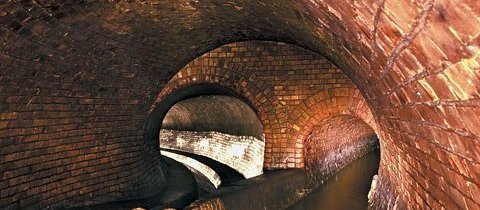

---
hide:
  - toc
---

# Location

## Mainz University Camps

All meetings will be held in the
Hörsaalzentrum Physik/Mathematik/Chemie
Bldg 2321
Duesbergweg 10-14
55128 Mainz
 

## Public transport in and around Mainz

The closest bus stops to the meeting location are Friedrich von Pfeiffer-Weg or Staudingerweg. For a complete map see [http://mvg-linien.de/pdf/Liniennetzplan.pdf](http://mvg-linien.de/pdf/Liniennetzplan.pdf). Note that you can pay the bus driver in cash for a single ticket (2.75 Euros); they will provide change, but bills may pose a problem). There are also cheaper options: you will get 5 tickets for 11 Euros, for a day ticket 6.60 Euros or a group day ticket for 9.90 Euros valid for 5 people.

Bus stops close to meeting location: 

Busses 54, 55, 58, 68, 75, 90 leave Friedrich von Pfeiffer-Weg in the direction of the main train station (and vice versa) typically every 5-10 min during the week and every 20 min on Sundays. It will take about 7 min by foot to reach the bus stop; the trip to the train station will take about 6 min.

Bus 69 leaves Staudingerweg typically every 10 min during the weekdays and every 30 min on Sundays. It will take about 2 min to reach the bus stop; the trip to the main train station will take about 9 min.

In principle you could also exit at one of the “University” bus stops. However, it will take you about 16 min to walk across campus to the meeting location.

## Sightseeing in Mainz

Even though 80% of the downtown was destroyed in multiple air raids by the Allies during World War II, there are many interesting spots to discover in Mainz. City walks are described here.

Among the museums, the [Gutenberg Museum](http://gutenberg-museum.de/index.php?id=29&L=1) honoring the inventor of book printing and presenting his technical and artistic achievements, is certainly special. It will even be nicer, once the museum remodel is complete.

A full list of museums can be found here, in [German](http://www.mainz.de/kultur-und-wissenschaft/museen/museen.php) or in [English](http://www.mainz.de/en/culture-museums-science/index.php).

Among the churches, the 1000-year-old [Mainz Cathedral](https://en.wikipedia.org/wiki/Mainz_Cathedral) and the painted glass windows by Chagall in St. Stephan are recommended. Locals are also very proud of the modern architecture of the new synagogue (credits Wikipedia). 

The old town and the riverfront are always worth a visit. Note that the signs of streets parallel to the Rhine River are blue, while those perpendicular to the river are red.

Mainz is also known for its “political” [carnival](http://www.mainzer-fastnachtsmuseum.de/) and political [cabaret](https://www.unterhaus-mainz.de/). There is even a [walk of fame](https://en.wikipedia.org/wiki/Walk_of_Fame_of_Cabaret).

Some of the sights in Mainz are even [unknown to many locals](http://www.regionalgeschichte.net/rheinhessen/mainz/kulturdenkmaeler.html). Examples are the “Haus zum Stein”; the oldest house in town (1250), or the 300-year-old underground tunnel system link. 

## Around Mainz

If you happen to stay longer, you may want to explore more of the region. The wine country on the “wrong” side of the Rhine always used to be much richer than the Mainz side. The Rheingau is famous for its wines, such as those from Schloß Volrath, cute villages such as Eltville, and monasteries such as Kloster Eberbach (credits Wikipedia).

The Unesco World Heritage Middle Rhine Valley, with its many sites, can be reached by train or ship. It is possible to combine both types of travel. The most interesting stretch runs from Bingen to St. Goar.

