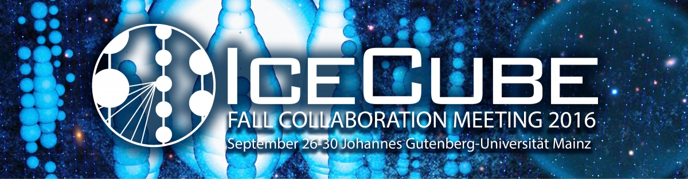

---
hide:
  - toc
---

# Registration & Payment

## Registration

Please register for the IceCube meeting on the Indico page. 

For the MANTs meeting, please register and pay on the MANTs meeting page.

## Payment

The meeting fee includes coffee breaks, reception and conference dinner. Note that there aren't any lunch options on campus on weekends, so lunch is included for the pre- and post-meetings.

IceCube Meeting: 210 EUR (includes breaks & banquet)
IceCube Banquet: Extra Guests 60 EUR per guest 	 
IceCube Pre-Meetings: 50 EUR (includes breaks & lunch on Sun, Oct 25th)
IceCube Software Bootcamp: 60 EUR (includes breaks & lunch on Sat, Oct 1st and Sun, Oct 2nd)
IceCube Communications Workshop: 10 EUR (includes lunch, date tbd)

### Credit Card 
Credit cards are accepted online through PayPal
Please note, PayPal may ask for your credit card information twice. The payment is only complete once PayPal displays a message saying that the payment was successful. 
PayPal - The safer, easier way to pay online!

### Bank Transfer

Please transfer the money to the following: 
 
Recipient: Landeshochschulkasse Mainz
Bank: Deutsche Bundesbank Filiale Mainz
IBAN: DE25 5500 0000 0055 0015 11
SWIFT/BIC: MARKDEF1550
Subject: 6101-28286-9563502, IceCube + (your name)
*Please be sure to include the full number string in the subject so that the money is accounted for in the correct place*

