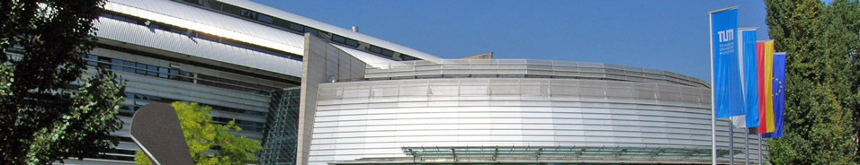

---
hide:
  - toc
---

# Banquet & Welcome Party

The banquet will be held on Thursday October 10th at Hofbräukeller, located at Innere Wiener Straße 19. 
A reception will be held at 7:00 PM with a buffet dinner running between 8 and 11 PM.
 
The best way to reach the building from city-center is with the underground train lines U4 and U5 to Max-Weber-Platz. 
If you are coming from the collaboration meeting location, you should take U2 to Hauptbahnhof and then transfer to U4/U5. 
Another option from the city center is to take tram lines 16 and 19.
 
Venue information is also available at their [website](http://www.hofbraeukeller.de/der-hofbraeukeller/anfahrt.html).
