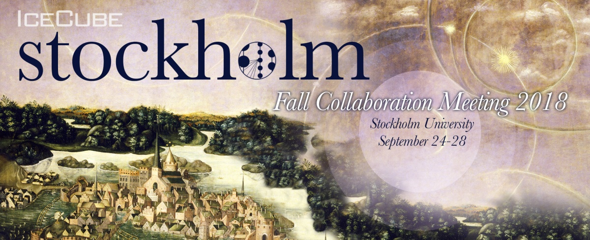

---
hide:
  - toc
---

# Payment and Registration Info

## Registration

Please register for the meeting by going to the [Indico Page](https://events.icecube.wisc.edu/conferenceDisplay.py?confId=102).
If this is your first time using IceCubes indico, you can try to login. If it doesn't work please email, ellie.feitlinger@icecube.wisc.edu and then access will be given using the email you used to send the request. 

## Payment
Early meeting fee* (Deadline - August 31) - 3000 SEK
Late meeting fee*: 3500 SEK
Banquet Guest fee: 860 per guest
 
*The meeting fee includes all break beverages/food, meeting handouts, welcome party and conference banquet dinner.

## To pay for the meeting

All meeting fees will need to be done by a wire transfer. All payments will be made to Stockholm University against an invoice. Once you register through Indico we will work with you or your institution lead to send either an individual or a group invoice depending on what the institution prefers. Wire transfer info will provided when you receive the invoice.
