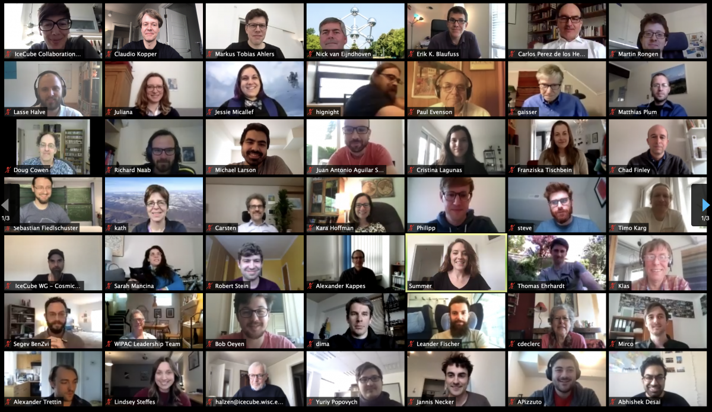

---
hide:
  - toc
---

# Home

{: align="left" style="height:217px;width:375px"}

### **^^Meeting Update: 2020 Fall Collaboration Meeting will be virtual^^**

Due to travel and safety concerns, the local Madison organizers have decided to cancel the in-person collaboration meeting. The 2020 Fall Collaboration Meeting will be conducted virtually, from Sept. 14 - 25, 2020.  Parallel sessions will be held the first week, Sept. 14 - 18. Plenary sessions will be held the second week, Sept. 21 - 25. A virtual banquet will be held Friday, Sept. 25 @11am CDT.

Please visit the [Indico meeting website](https://events.icecube.wisc.edu/event/125/) 
to [Register](https://events.icecube.wisc.edu/event/125/registrations/78/), view the 
[Timetable](https://events.icecube.wisc.edu/event/125/timetable/#20200914), and submit your 
[Abstract](https://events.icecube.wisc.edu/event/125/abstracts/).
