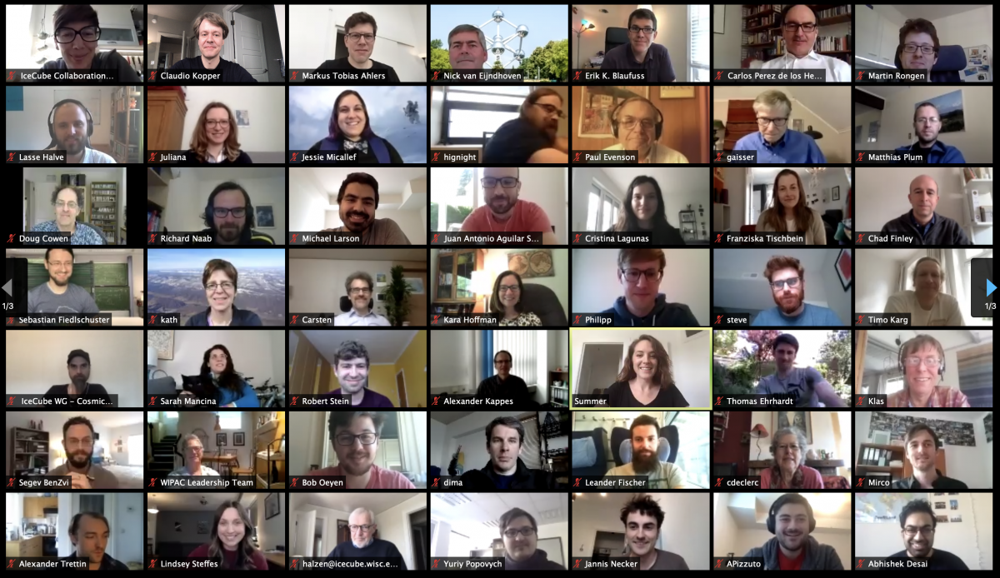

---
hide:
  - toc
---

# Home

{: align="left" style="height:217px;width:375px"}

### **^^Meeting Update: 2021 Spring Collaboration Meeting will be virtual^^**

Due to travel and safety concerns, the local organizers in Aachen, Germany have decided to cancel
the in-person collaboration meeting. The 2021 Spring Collaboration Meeting will be conducted 
virtually, from March 17 - 26, 2021.  Parallel sessions will be March 17 - 19 and March 22 - 23, 
and the plenary sessions will be March 24 - 26.

Please visit the [Indico meeting website](https://events.icecube.wisc.edu/event/127/) 
to [Register](https://events.icecube.wisc.edu/event/127/registrations/80/), view the 
[Timetable](https://events.icecube.wisc.edu/event/127/timetable/), and submit your 
[Abstract](https://events.icecube.wisc.edu/event/127/abstracts/).
